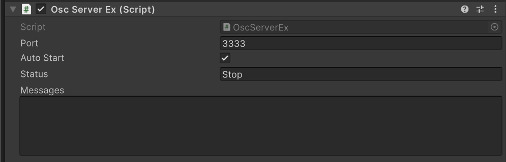
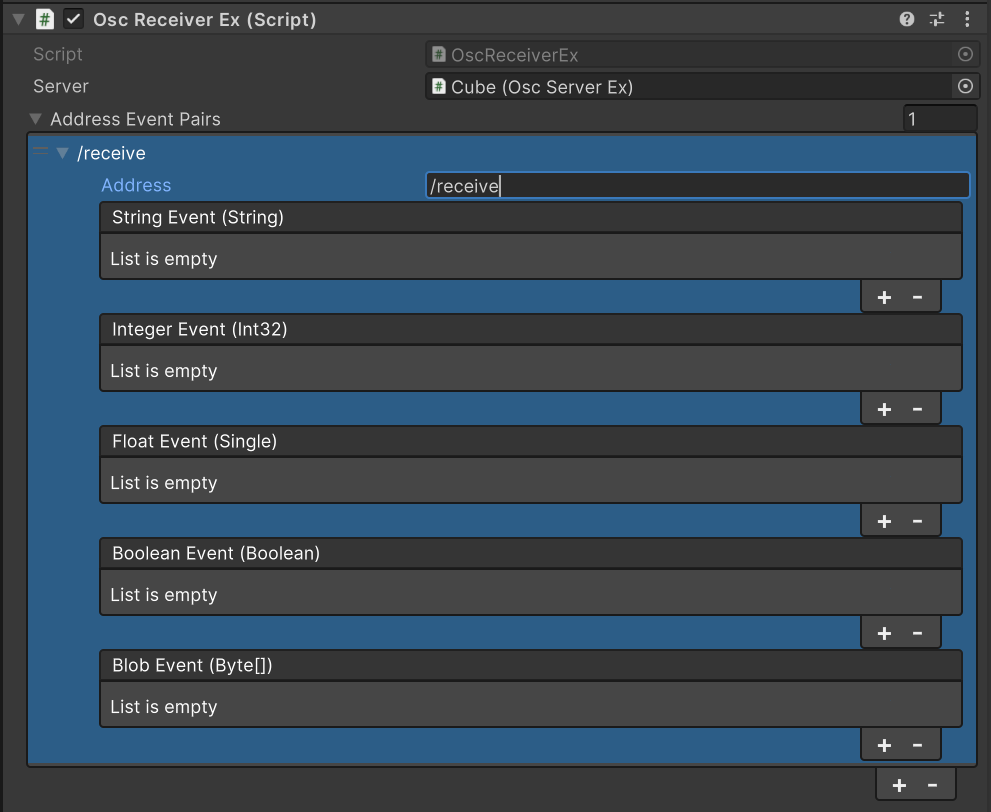

# OSC Jack Expansion

[OSC Jack](https://github.com/keijiro/OscJack) と [uOSC](https://github.com/hecomi/uOSC) を拡張し、`byte[]`(blob) の送受信を含む統一的なOSC通信コンポーネントを提供するUnityパッケージです。

## 依存パッケージ

- [jp.keijiro.osc-jack](https://github.com/keijiro/OscJack) >= 1.0.3
- [com.hecomi.uosc](https://github.com/hecomi/uOSC) >= 2.0.3

## インストール

### 1. Scoped Registries の追加

`Packages/manifest.json` に以下を追加してください。

```json
"scopedRegistries": [
    {
        "name": "Keijiro",
        "url": "https://registry.npmjs.com",
        "scopes": ["jp.keijiro"]
    },
    {
        "name": "Hecomi",
        "url": "https://registry.npmjs.com",
        "scopes": ["com.hecomi"]
    }
]
```

### 2. パッケージの追加

Unity Package Manager > Add package from git URL:

```
https://github.com/MudShipProject/OSC-Jack-Expansion.git
```

## コンポーネント

### OscSenderEx - 送信

`Connect(ip, port)` で接続し、`Send()` で各型のデータを送信します。

```csharp
// 送信するデータ構造を定義
[System.Serializable]
public class PlayerData
{
    public int id;
    public string name;
    public float score;
}
```

```csharp
var sender = GetComponent<OscSenderEx>();

// 接続
sender.Connect("192.168.1.100", 8000);

// 各型の送信
sender.Send("/address");              // 引数なし
sender.Send("/address", 42);          // int
sender.Send("/address", 3.14f);       // float
sender.Send("/address", "hello");     // string
sender.Send("/address", true);        // bool (int 1/0 に変換)

// OscBlobHelper でオブジェクトを byte[] に変換して送信
var data = new PlayerData { id = 1, name = "test", score = 99.5f };
byte[] blob = OscBlobHelper.Serialize(data);
sender.Send("/playerdata", blob);

// 切断
sender.Disconnect();
```

### OscServerEx - 受信サーバー

UDPでOSCメッセージを受信するサーバーです。Inspector で Port と Auto Start を設定できます。



| プロパティ | 説明 |
|---|---|
| **Port** | 受信するUDPポート番号 |
| **Auto Start** | OnEnable 時に自動でサーバーを開始する |

### OscReceiverEx - 受信イベント

OSCアドレスごとに UnityEvent で受信データを振り分けます。

Inspector で `OscServerEx` への参照と、受信したいアドレスを設定します。



- **Server** - `OscServerEx` コンポーネントへの参照（未設定の場合は同じ GameObject から自動取得）
- **Address Event Pairs** - 受信するOSCアドレスとイベントのペア
  - `*` で全アドレスにマッチ
  - `/namespace/*` でプレフィックスマッチ

```csharp
var receiver = GetComponent<OscReceiverEx>();

// コードからアドレスを追加
var pair = receiver.AddAddressEventPair("/playerdata");
pair.stringEvent.AddListener(val => Debug.Log(val));
pair.integerEvent.AddListener(val => Debug.Log(val));
pair.floatEvent.AddListener(val => Debug.Log(val));

// OscBlobHelper で byte[] をオブジェクトに復元
pair.blobEvent.AddListener(bytes =>
{
    var data = OscBlobHelper.Deserialize<PlayerData>(bytes);
    Debug.Log($"{data.id}: {data.name} - {data.score}");
});

// アドレスの削除
receiver.RemoveAddressEventPair("/playerdata");
```

## License

MIT
